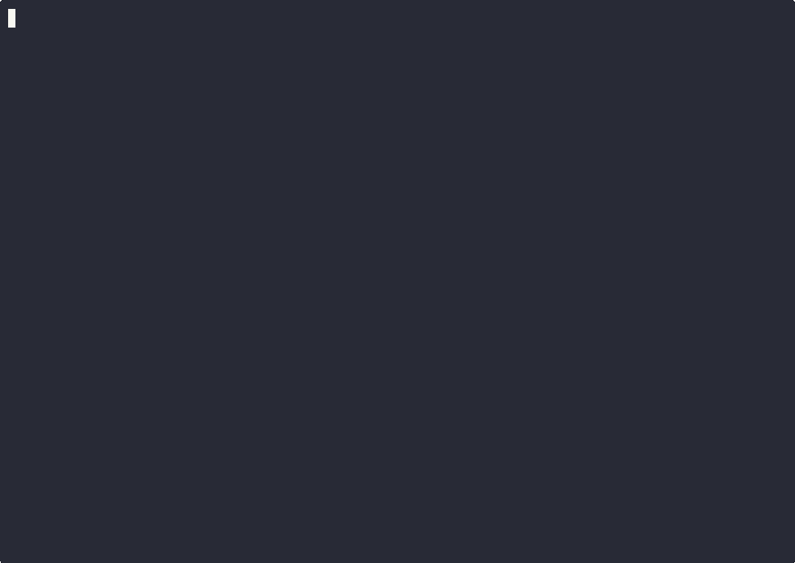

# 💰 ValutaTrade Hub

Платформа, которая позволяет пользователям регистрироваться, управлять своим виртуальным портфелем фиатных и криптовалют, совершать сделки по покупке/продаже, а также отслеживать актуальные курсы в реальном времени. 


---

## 🚀 CLI команды

```bash
# регистрация
register --username <str> --password <str>

# аутентификация
login --username <str> --password <str>

# просмотр портфеля
show-portfolio [--base <str>]

# покупка валюты
buy --currency <str> --amount <float>

# продажа валюты
sell --currency <str> --amount <float>

# получение курса калюты
get-rate --from <str> --to <str>

# обновление курсов валют
update-rates [--source <str>]

# получение курсов валют с фильтрацией
show-rates [--top <int>] [--base <str>] [--currency <str>]
```


---

## 🔧 Технические особенности

- **CLI** — интерфейс командной строки отделён от бизнес-логики; вывод данных форматируется для удобства пользователя.
- **Хранение данных** — пользователи, портфели и курсы сохраняются в отдельных JSON-файлах (users.json, portfolios.json, rates.json, exchange-rate.json).
- **Валюта** — разные типы валют реализованы через классы Currency/FiatCurrency/CryptoCurrency.
- **Кэширование и TTL** — курсы валют хранятся локально и обновляются по истечении TTL командой update-rates.
- **Ошибки** — централизованная обработка через пользовательские исключения (InsufficientFundsError, CurrencyNotFoundError, InvalidCommandFormatError, ApiRequestError).
- **Логирование** — ключевые действия (buy, sell) фиксируются с указанием пользователя, валюты, суммы и результата.


---

## ⚡ Настройка и запуск проекта

В проекте используется Poetry и Makefile для управления зависимостями, сборкой и запуском.

##### Установка зависимостей
```bash
make install
```
##### Локальная установка пакета
```bash
make package-install
```
##### Сборка пакета
```bash
make build
```
##### Запуск приложения
```bash
make valutatrade
```
##### Очистка сгенерированных файлов
```bash
make clean
```


---

## 🎥 Демонстрация использования (Asciinema)
